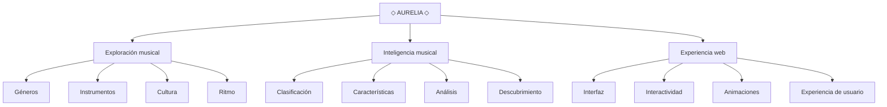

<div align="center">

# ◇ A U R E L I A ◇

### THE ART OF SOUND

**Exploración musical · Cultura · Inteligencia · Tecnología**

<br>


</div>

---

# ◇ AURELIA

> **La música no solamente se escucha. También puede explorarse, analizarse y comprenderse.**

Aurelia es una experiencia digital dedicada a explorar la música desde una perspectiva cultural, tecnológica y analítica.

El proyecto combina documentación, clasificación musical, instrumentos, conceptos sonoros y una experiencia web interactiva para demostrar cómo una idea puede evolucionar mediante el uso de Git y GitHub.

---

# ◇ ÍNDICE

- [Aurelia](#-aurelia)
- [Concepto](#-concepto)
- [Objetivo](#-objetivo)
- [Visión](#-visión)
- [Inteligencia musical](#-inteligencia-musical)
- [Universo musical](#-universo-musical)
- [Instrumentos](#-instrumentos)
- [Arquitectura](#-arquitectura)
- [Stack tecnológico](#-stack-tecnológico)
- [Experiencia web](#-experiencia-web)
- [Instalación y uso](#-instalación-y-uso)
- [Estado del proyecto](#-estado-del-proyecto)
- [Roadmap](#-roadmap)
- [Filosofía](#-filosofía)
- [Autor](#-autor)
- [Licencia](#-licencia)

---

# ◇ CONCEPTO

Aurelia parte de una idea sencilla:

> **Convertir la exploración musical en una experiencia digital.**

La música puede estudiarse desde diferentes perspectivas.

Aurelia conecta:

- 🎧 Géneros musicales
- 🎹 Instrumentos
- 🥁 Ritmo
- 🎼 Composición
- 🌎 Cultura
- 🧠 Análisis
- 🔎 Descubrimiento
- 💻 Tecnología

El objetivo no es únicamente presentar información, sino organizarla de una forma visual, intuitiva y atractiva.

---

# ◇ OBJETIVO

El objetivo principal de Aurelia es desarrollar una experiencia digital capaz de presentar y organizar información musical utilizando herramientas de desarrollo web y control de versiones.

### Objetivos específicos

- Explorar diferentes géneros musicales.
- Identificar instrumentos representativos.
- Analizar características musicales.
- Relacionar música y cultura.
- Crear una experiencia web interactiva.
- Aplicar HTML5, CSS3 y JavaScript.
- Utilizar Git para controlar la evolución del proyecto.
- Utilizar GitHub para almacenar y documentar el proyecto.
- Mantener un historial claro de modificaciones.

---

# ◇ VISIÓN

Aurelia busca evolucionar progresivamente.

La visión del proyecto puede resumirse en:

```text
EXPLORAR
   ↓
COMPRENDER
   ↓
ANALIZAR
   ↓
DESCUBRIR
   ↓
EXPERIMENTAR
```

A largo plazo, Aurelia podría incorporar sistemas de recomendación, visualizaciones musicales y herramientas de análisis más avanzadas.

---

# ◇ INTELIGENCIA MUSICAL

La inteligencia musical de Aurelia se organiza mediante diferentes dimensiones.

### ◇ Género

Permite clasificar una expresión musical dentro de un contexto determinado.

### ◇ Ritmo

Representa los patrones temporales y el movimiento que caracterizan una experiencia sonora.

### ◇ Instrumentación

Identifica los instrumentos utilizados y su relación con diferentes estilos.

### ◇ Cultura

Relaciona la música con su contexto histórico, social y cultural.

### ◇ Evolución

Permite observar cómo los estilos musicales cambian y desarrollan nuevas expresiones.

---

# ◇ UNIVERSO MUSICAL

Aurelia presenta una selección inicial de familias musicales.

## 🎸 Rock

Caracterizado por el protagonismo de guitarras, bajo, batería y diferentes estructuras rítmicas.

Su evolución ha producido una enorme variedad de subgéneros y movimientos culturales.

---

## 🎤 Pop

Una expresión musical ampliamente relacionada con melodías reconocibles, producción contemporánea y evolución constante.

---

## 🎷 Jazz

Destaca por la improvisación, la interacción entre músicos y una gran riqueza armónica y rítmica.

---

## 🎻 Música clásica

Representa un amplio conjunto de tradiciones compositivas e interpretativas desarrolladas a lo largo de diferentes períodos históricos.

---

## 🎛️ Electrónica

Combina tecnología, síntesis, producción digital, programación sonora y experimentación.

---

## 🪘 Música latina

Comprende una gran diversidad de expresiones musicales, ritmos e influencias culturales provenientes de diferentes regiones.

---

# ◇ INSTRUMENTOS

Los instrumentos constituyen una parte esencial del universo de Aurelia.

## 🎸 Cuerda

- Guitarra
- Bajo
- Violín
- Viola
- Violonchelo
- Contrabajo

## 🎹 Teclado

- Piano
- Órgano
- Sintetizador
- Teclado electrónico

## 🥁 Percusión

- Batería
- Cajón
- Bongós
- Congas
- Timbales

## 🎷 Viento

- Saxofón
- Trompeta
- Flauta
- Clarinete
- Trombón

## 🎛️ Electrónicos

- Sintetizador
- Sampler
- Caja de ritmos
- Controlador MIDI
- Estación de trabajo de audio digital

---

# ◇ ARQUITECTURA

La arquitectura conceptual de Aurelia se representa mediante el siguiente flujo:



---

# ◇ STACK TECNOLÓGICO

### HTML5

Construye la estructura semántica de la experiencia web.

### CSS3

Controla la composición visual, diseño responsive, animaciones, transiciones y presentación gráfica.

### JavaScript ES6+

Controla la interacción, filtros, navegación dinámica y comportamiento de la interfaz.

### Markdown

Construye la documentación principal del proyecto.

### Git

Controla la evolución y el historial de versiones.

### GitHub

Aloja el repositorio y permite compartir la evolución del proyecto.

---

# ◇ EXPERIENCIA WEB

La experiencia web de Aurelia está diseñada alrededor de una estética cinematográfica.

La interfaz busca combinar:

**TECNOLOGÍA + MÚSICA + MOVIMIENTO + INFORMACIÓN**

### Elementos principales

- Hero visual.
- Identidad Aurelia.
- Navegación.
- Explorador musical.
- Filtros por género.
- Tarjetas interactivas.
- Métricas musicales.
- Animaciones.
- Diseño responsive.
- Microinteracciones.

---

# ◇ INSTALACIÓN Y USO

Clona el repositorio:

```bash
git clone https://github.com/TU-USUARIO/aurelia.git
```

Accede al proyecto:

```bash
cd aurelia
```

Abre el archivo:

```text
index.html
```

También puede ejecutarse mediante un servidor local durante el desarrollo.

---

# ◇ ESTADO DEL PROYECTO

**🟣 EN DESARROLLO**

### Completado

- [x] Identidad de Aurelia
- [x] README principal
- [x] Investigación conceptual
- [x] Objetivos
- [x] Universo musical
- [x] Instrumentos
- [x] Arquitectura conceptual
- [x] Stack tecnológico
- [x] Roadmap
- [x] Aplicación web inicial
- [x] Sistema de filtros
- [x] Interfaz responsive

### En desarrollo

- [ ] Buscador musical
- [ ] Sistema de favoritos
- [ ] Mayor catálogo musical
- [ ] Visualizaciones avanzadas
- [ ] Sistema de recomendaciones
- [ ] Análisis musical ampliado

---

# ◇ ROADMAP

## VERSION 1.0.0 — FOUNDATION

La primera versión establece la identidad y estructura fundamental.

- Documentación.
- Arquitectura.
- Catálogo conceptual.
- Experiencia web inicial.
- Sistema de filtros.
- Identidad visual.

---

## VERSION 1.1.0 — EXPLORATION

La siguiente etapa ampliará las posibilidades de navegación.

- Buscador.
- Filtros avanzados.
- Categorías adicionales.
- Mayor catálogo musical.
- Navegación mejorada.

---

## VERSION 1.5.0 — INTELLIGENCE

Aurelia incorporará una capa de análisis más avanzada.

- Clasificación musical.
- Métricas.
- Visualizaciones.
- Características musicales.
- Sistema de descubrimiento.

---

## VERSION 2.0.0 — AURELIA NEXT

La visión futura contempla:

- Recomendaciones personalizadas.
- Análisis musical avanzado.
- Perfiles de artistas.
- Visualizaciones dinámicas.
- Mayor profundidad cultural.
- Experiencia de usuario ampliada.

---

# ◇ FILOSOFÍA

> **La música no solamente se escucha.**

> **Se explora.**

> **Se comprende.**

> **Se transforma.**

Aurelia busca convertir esa idea en una experiencia digital.

---

# ◇ AUTOR

## Manuel Jurado

Proyecto académico desarrollado para la materia de Tecnología.

**Proyecto:** Aurelia  
**Concepto:** Exploración e inteligencia musical  
**Versión:** 1.0.0  
**Estado:** En desarrollo

---

# ◇ LICENCIA

Este proyecto utiliza la licencia **MIT**.

Consulta el archivo [`LICENSE`](LICENSE) para conocer los términos completos.

---

<div align="center">

## ◇ AURELIA ◇

### THE ART OF SOUND

**EXPLORE · UNDERSTAND · EXPERIENCE**

</div>
